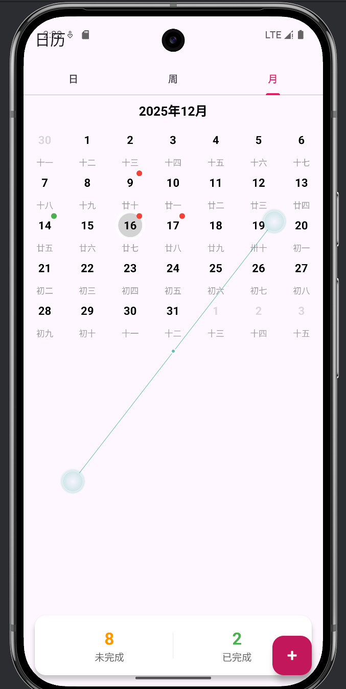
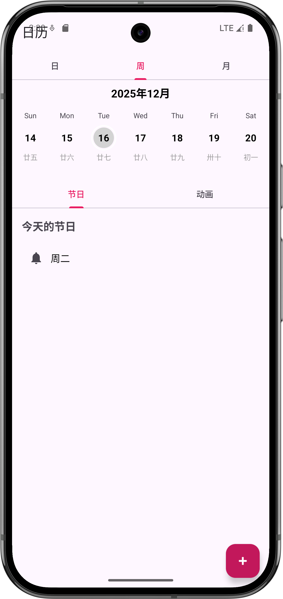
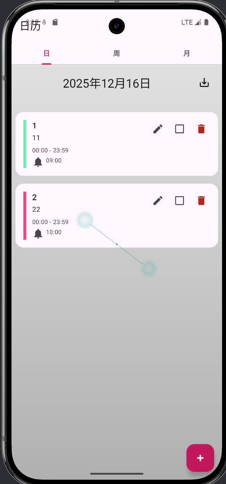
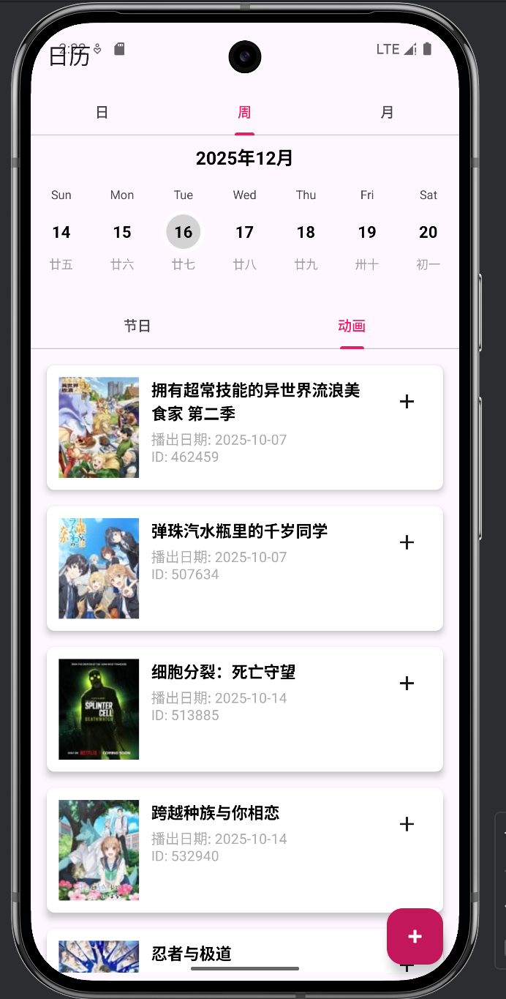
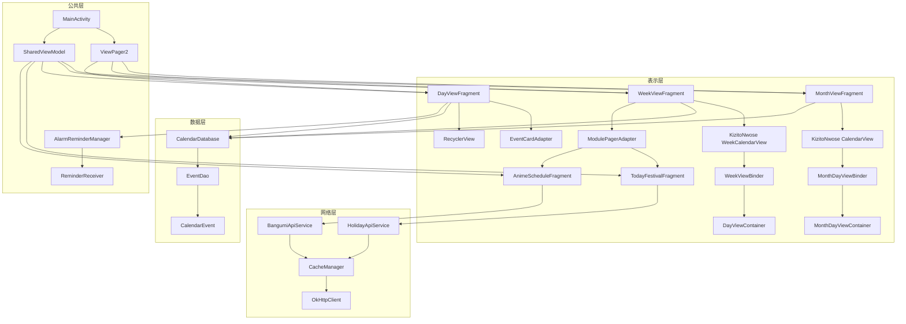

# MyCalendarApp

  

  <strong>一个功能丰富的 Android 日历应用程序</strong>

  <a href="#features">功能</a> •
  <a href="#screenshots">截图</a> •
  <a href="#tech-stack">技术栈</a> •
  <a href="#architecture">架构</a>

## Features

### 📅 多视图日历
- **日视图**: 查看每日详细安排
- **周视图**: 浏览一周的日程安排
- **月视图**: 纵览整个月份的事件分布

### 🎌 节假日查询
- 自动识别中国法定节假日
- 显示节假日详细信息
- 区分工作日与休息日

### 📺 番剧时间表
- 集成 Bangumi API 获取番剧播放时间
- 按日期筛选当日番剧
- 一键添加番剧到个人日程

### 📝 事件管理
- 添加、编辑、删除个人事件
- 为事件设置提醒时间
- 智能颜色分类系统
- 防止重复事件添加

### 🔔 提醒功能
- 事件提醒通知
- 悬浮窗提醒显示
- 精确闹钟权限支持

### 💾 网络缓存
- HTTP 级别缓存机制
- 减少重复网络请求
- 离线状态下仍可查看缓存数据

## Screenshots

  
  
  
  

## Tech Stack

### 核心技术
- **语言**: Kotlin
- **SDK 版本**: Min SDK 31, Target SDK 36
- **架构模式**: MVVM (Model-View-ViewModel)

### 主要依赖库
| 功能 | 库名 | 版本 |
|------|------|------|
| 日历组件 | KizitoNwose Calendar | 2.9.0 |
| 网络请求 | OkHttp | 5.3.0 |
| JSON 解析 | Gson | 2.13.2 |
| 图片加载 | Glide | 5.0.5 |
| 数据库 | Room | 2.8.3 |
| 生命周期管理 | Lifecycle | 2.9.4 |
| 导航组件 | Navigation | 2.7.5 |

### UI 框架
- **传统视图系统**: XML Layouts + View Binding
- **现代 UI 框架**: Jetpack Compose
- **Material Design**: Material Components

## Architecture

本项目遵循组件化开发原则，采用 MVVM 架构模式：

app/   
├── data/ # 数据层  
│ ├── local/ # 本地数据（Room 数据库）  
│ └── network/ # 网络相关（缓存管理）  
├── domain/ # 领域层   
│ ├── manager/ # 业务管理器  
│ └── utils/ # 工具类  
├── presentation/ # 表示层  
│ ├── adapter/ # RecyclerView 适配器  
│ ├── binder/ # 日历视图绑定器  
│ ├── container/ # 日历容器  
│ ├── ui/ # UI 组件（Fragment、Activity）  
│ └── viewmodel/ # ViewModel └── ui/ # 主题相关  
└── ui/ # 主题相关  

### 软件架构图

### 核心组件

1. **Calendar Views**
    - 使用 KizitoNwose Calendar 实现三种日历视图
    - 支持流畅的日期切换和选择

2. **Network Layer**
    - 基于 OkHttp 的网络请求
    - 自定义 CacheManager 实现 HTTP 缓存
    - 支持离线模式

3. **Data Persistence**
    - Room 数据库存储本地事件
    - 事件颜色智能分配算法

4. **Third-party Integrations**
    - Bangumi API 获取番剧信息
    - 节假日 API 查询节假日数据

## Getting Started

### 环境要求
- Android Studio Ladybug | 2025.1.1 或更高版本
- JDK 11+
- Android SDK 36

### 权限说明
应用需要以下权限：
- 网络访问权限 (INTERNET)
- 精确闹钟权限 (SCHEDULE_EXACT_ALARM)
- 悬浮窗权限 (SYSTEM_ALERT_WINDOW)
- 通知权限 (POST_NOTIFICATIONS)

## License

版权所有 © 2025 Kei

本项目仅供学习交流使用。